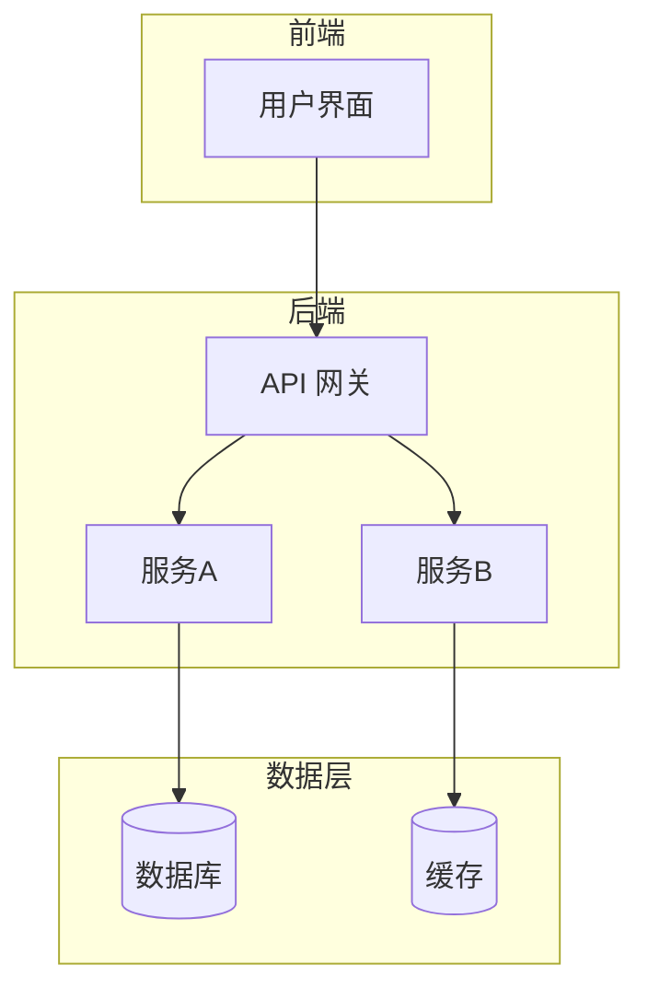
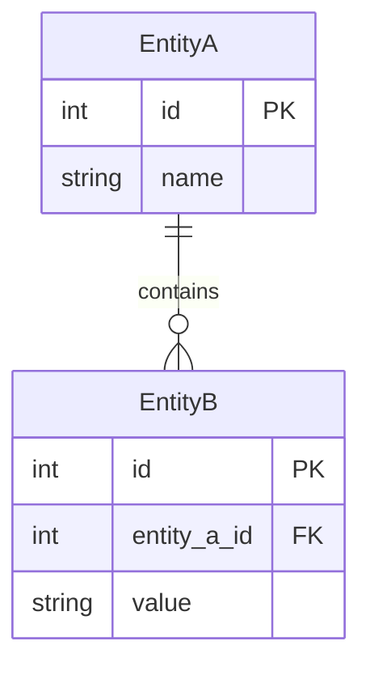
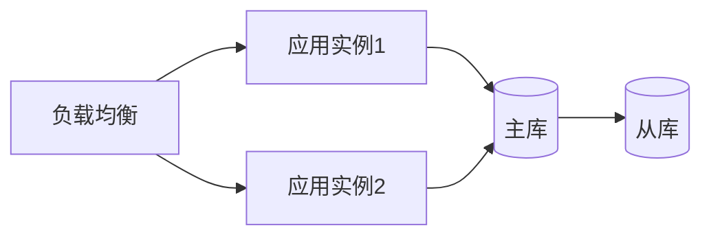
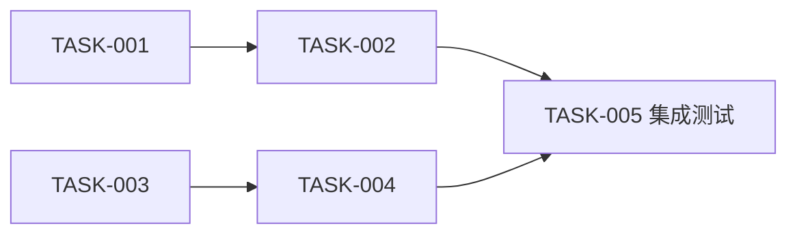

# 架构与任务拆解文档模板

推荐存放路径：`<项目根目录>/Agent_doc/System_Architecture_and_Task_Breakdown.md`

以下为 `System_Architecture_and_Task_Breakdown.md` 的标准结构。

---

# [项目名称] 系统架构与任务拆解

**版本**: v1.0  
**日期**: [YYYY-MM-DD]  
**基于 PRD 版本**: [PRD 版本号]  
**作者**: 系统架构与任务拆解专家 (AI)

---

## 1. 概述

### 1.1 文档目的
本文档基于 `PRD.md` 进行系统技术架构设计和开发任务拆解，为后续开发和测试提供指导。

### 1.2 PRD 引用
- 文档路径：`Agent_doc/PRD.md`
- 核心目标：[摘要]

---

## 2. 技术栈选型

| 层次 | 技术选型 | 版本 | 选型理由 |
|------|----------|------|----------|
| 前端框架 | | | |
| 后端框架 | | | |
| 数据库 | | | |
| 缓存 | | | |
| 消息队列 | | | |
| 容器化 | | | |
| CI/CD | | | |

---

## 3. 系统架构设计

### 3.1 架构总览

### 3.2 模块划分

#### 模块 1：[模块名称]
- **职责**：[单一职责描述]
- **对外接口**：
  - 输入：[描述]
  - 输出：[描述]
- **依赖模块**：[列表]
- **关键设计决策**：[说明]

### 3.3 数据架构

### 3.4 接口设计

| 接口 | 方法 | 路径 | 说明 |
|------|------|------|------|
| 接口 1 | GET | /api/v1/resource | 获取资源列表 |
| 接口 2 | POST | /api/v1/resource | 创建资源 |

### 3.5 部署架构

---

## 4. 任务拆解清单

| 任务 ID | 任务名称 | 所属模块 | 输入 | 输出 | 依赖 | 复杂度 | 可并行 | 验收标准 |
|---------|----------|----------|------|------|------|--------|--------|----------|
| TASK-001 | | | | | - | 低 | 是 | |
| TASK-002 | | | | | TASK-001 | 中 | 否 | |
| TASK-003 | | | | | - | 中 | 是 | |

---

## 5. 执行计划

### 5.1 任务依赖图

### 5.2 并行任务分组

| 阶段 | 可并行任务 | 前置条件 |
|------|-----------|----------|
| 阶段 1 | TASK-001, TASK-003 | 无 |
| 阶段 2 | TASK-002, TASK-004 | 阶段 1 完成 |

### 5.3 关键路径

[描述影响整体交付时间的关键任务链]

### 5.4 集成汇总点

| 集成点 | 涉及任务 | 集成内容 | 验证方式 |
|--------|----------|----------|----------|
| 集成点 1 | TASK-002, TASK-004 | 前后端联调 | 集成测试 |

---

## 6. 风险与缓解措施

| 风险 | 概率 | 影响 | 缓解措施 |
|------|------|------|----------|
| 风险 1 | 高/中/低 | 高/中/低 | [措施] |
| 风险 2 | 高/中/低 | 高/中/低 | [措施] |

---

## 变更记录

| 版本 | 日期 | 修改内容 | 修改人 |
|------|------|----------|--------|
| v1.0 | [YYYY-MM-DD] | 初始版本 | AI |
